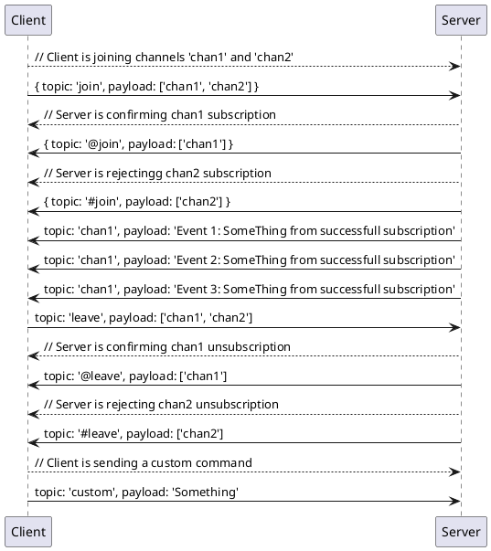
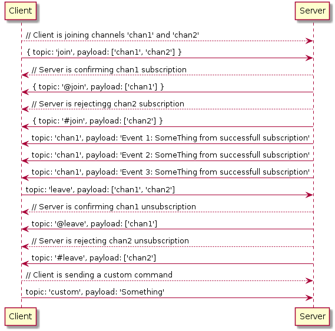

Transport Exchange Protocol
------

Both Server and client use data exchange format as following:

```json
{
  "topic": "Channel or command",
  "payload": "Any serializable payload"
}
```

Server support 2 system commands: join and leave


Join Channel
---

`join` - requests to join list of channels. Payload is channel list. Channel name should not match any of system reply codes: `@join` `#join` `@leave` `#leave`

```json
{
  "topic": "join",
  "payload": ["channel1", "channel2.subtopic"]
}
```

Server will respond with either `@join` or `#join` topic. `@` stands for succesfull joining, `#` for failed one.

```json
{
  "topic": "@join",
  "payload": ["channel1"]
}
``` 

Leave Channel
---
`leave` - requests to leave list of channels. Payload is channel list. Channel name should not match any of system reply codes: `@join` `#join` `@leave` `#leave`

```json
{
  "topic": "leave",
  "payload": ["channel1", "channel2.subtopic"]
}
```

Server will respond with either `@leave` or `#leave` topic. `@` stands for succesfull joining, `#` for failed one.

```json
{
  "topic": "@leave",
  "payload": ["channel1"]
}
``` 

Receiving server messages
---

Server can emit event with custom payload to any channel or broadcast it globally

```json
{
  "topic": "channel1",
  "payload": {"foo": "bar"}
}
```

```json
{
  "payload": {"foo":  "bar"}
}
```

UML Sample
-----


